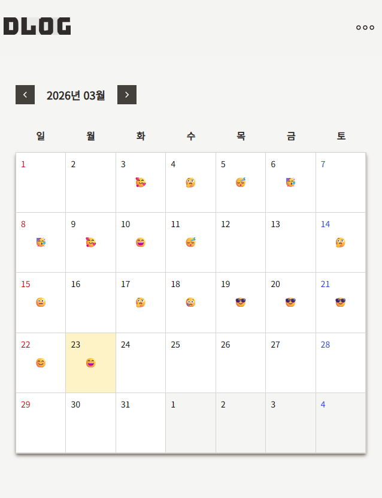
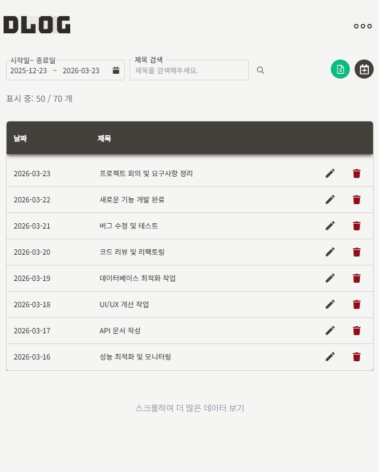
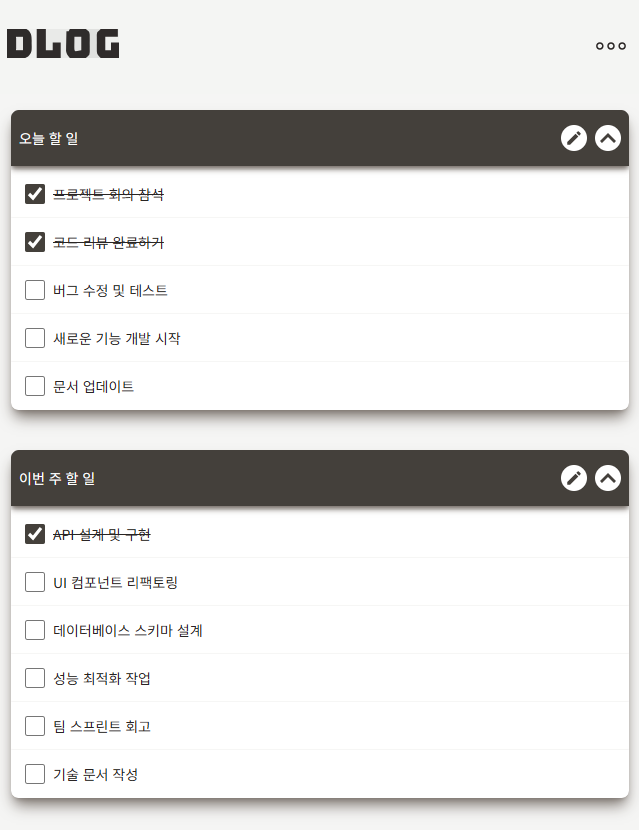
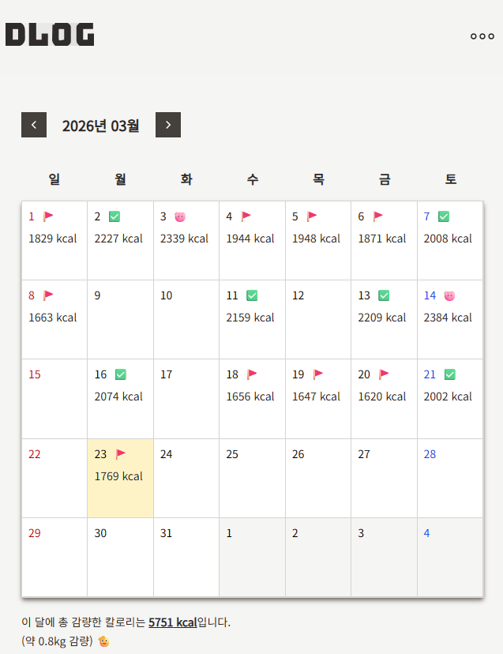
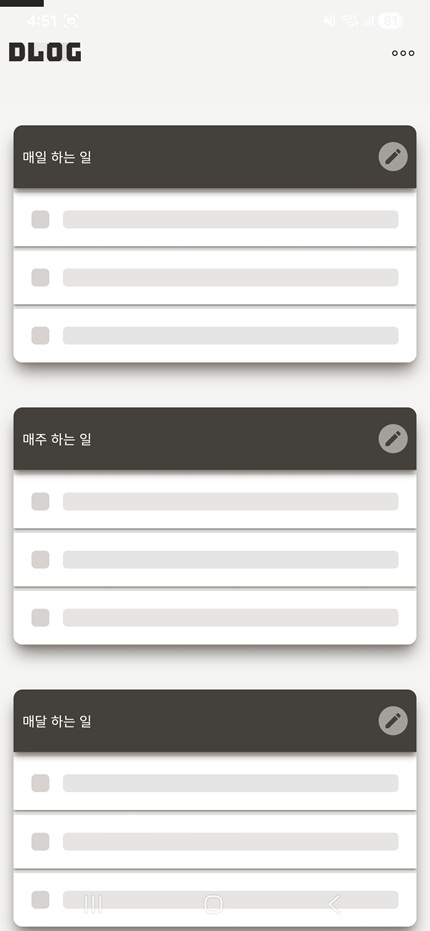

# Daily Log

> 개인 생산성 관리를 위한 풀스택 웹 애플리케이션  
> **Next.js (App Router) · NestJS · Prisma · PostgreSQL**

Daily Log는 하루 회고, 할 일, 루틴, 로그, 칼로리 관리를 한 곳에서 다룰 수 있도록 만든 서비스입니다.  
단순 CRUD 구현에 그치지 않고, **인증 구조**, **서버 상태 관리**, **SSR 초기 데이터 로딩**, **대용량 리스트 렌더링** 을 중심으로 설계하고 구현했습니다.

---

## 프로젝트 개요

- **프로젝트명**: Daily Log
- **형태**: 개인 사이드 프로젝트
- **구성**: Monorepo (Frontend / Backend)
- **목적**: 일상 기록, 루틴 관리, 할 일 추적, 기록 탐색을 통합한 생산성 서비스 구현

### 이런 점에 집중했습니다

- 로그 목록에서 **무한 스크롤**과 **가상화 테이블**을 적용한 데이터 탐색 UX
- **JWT Access / Refresh Token + 쿠키 기반 인증 구조**
- Next.js App Router 환경에서 **Server / Client 경계 분리**
- **React Query 기반 서버 상태 관리 표준화**
- **페이지 첫 진입 시 SSR 프리페치 + initialData 적용**으로 초기 로딩 경험 개선

---

## 주요 기능

### 1) 회고 / 감정 기록

- 하루 단위 회고 작성
- 감정 상태 기록
- 누적된 일상 로그를 기반으로 개인 기록 관리

### 2) 할 일 관리

- 오늘 / 주간 / 월간 / 연간 단위 할 일 관리
- Drag & Drop 기반 정렬
- 일정 단위로 태스크를 나눠 관리할 수 있는 UI 제공

### 3) 루틴 관리

- 반복 수행할 루틴 템플릿 생성
- 루틴 복사 및 재사용
- 일상 루틴을 구조적으로 기록할 수 있도록 설계

### 4) 로그 관리

- 날짜 범위, 제목 기반 검색
- 무한 스크롤을 통한 연속 탐색
- 가상화 테이블 기반 렌더링 최적화
- 엑셀 다운로드 기능 제공

### 5) 칼로리 관리

- 식단 및 칼로리 기록
- 월간 단위 데이터 확인
- 기록 기반 통계 확인

### 6) 사용자 설정

- 프로필 정보 확인 및 수정
- 비밀번호 변경
- 인증 기반 보호 페이지 접근 제어

---

## 기술 스택

### Frontend

- **Next.js 15** (App Router)
- **React 19**
- **TypeScript**
- **Tailwind CSS**
- **React Query (@tanstack/react-query)**
- **Jotai**
- **react-window**
- **@dnd-kit**
- **notistack**

### Backend

- **NestJS**
- **Prisma**
- **PostgreSQL**
- **JWT / Passport**
- **class-validator**

### Environment

- **pnpm workspace**
- **Monorepo**
- **Capacitor**

---

## 디렉터리 구조

```text
Daily-Log/
├── apps/
│   ├── frontend/   # Next.js App Router 기반 클라이언트
│   └── backend/    # NestJS API 서버
├── package.json
├── pnpm-workspace.yaml
└── README.md
```

### 역할 분리

- **frontend**: UI, 사용자 인터랙션, 서버 상태 관리, 인증 쿠키 처리
- **backend**: 인증, 사용자 정보, 로그 / 루틴 / 칼로리 관련 API
- **database**: Prisma schema 기반 데이터 모델 관리

---

## 프론트엔드 아키텍처 변경 사항

최근 프론트엔드 구조를 다음 방향으로 리팩터링했습니다.

### 1. Access Token을 포함한 인증 정보를 쿠키 기반으로 일원화

기존에는 Access Token을 브라우저 상태와 함께 다루는 흐름이 있었지만, 현재는 **Access Token / Refresh Token 모두 쿠키 기반**으로 전달되도록 정리했습니다.

- 클라이언트 요청은 `credentials: "include"` 기반으로 `/api/*`에 요청
- Next.js Route Handler가 쿠키를 포함한 상태로 백엔드 API에 재전달
- 백엔드에서 반환한 `Set-Cookie`를 다시 프론트 응답에 전달
- middleware에서는 **refresh token 존재 여부**를 기준으로 public/private 페이지 접근 제어
- 인증 만료 시 refresh 요청 후 재시도하는 흐름을 서버 레이어에 포함

이 구조를 통해 브라우저에서 토큰을 직접 조작하는 책임을 줄이고, **프론트와 백엔드 사이의 인증 처리 경계**를 더 명확하게 나눴습니다.

### 2. React Query + API Route Handler 기반 인프라 구축

기존 화면/컴포넌트 단위 데이터 요청 방식을 정리하고, **서버 상태는 React Query**, **백엔드 통신 중계는 Next.js API Route Handler**로 표준화했습니다.

구조는 아래와 같습니다.

```text
Client Component
  → React Query Hook
    → /api/* Route Handler
      → backendFetch
        → NestJS API
```

이 구조로 통일하면서 얻은 점은 다음과 같습니다.

- 쿠키 처리 방식과 응답 처리 로직도 한곳에 모으기
- queryKey / invalidateQueries 패턴으로 캐시 무효화 일관성 확보
- QueryProvider에서 전역 에러 처리, 로딩 상태 추적, Devtools 연결 가능

### 3. 각 페이지 첫 진입 시 SSR 데이터 프리페치 및 initialData 적용

첫 진입 시 필요한 데이터는 App Router의 서버 컴포넌트 페이지에서 먼저 가져오고, 클라이언트 훅에는 `initialData`로 주입하는 패턴을 적용했습니다.

적용 페이지 예시:

- 홈
- 로그
- 투두
- 루틴
- 칼로리

이 방식으로:

- 첫 진입 시 빈 화면에서 클라이언트 fetch가 시작되는 구조를 줄이고
- 초기 렌더링 시 바로 데이터가 보이도록 하며
- 이후 상호작용과 데이터 갱신은 React Query가 담당하도록 분리했습니다.

즉, **초기 로딩은 서버가 책임지고, 이후 서버 상태 동기화는 React Query가 담당하는 구조**입니다.

---

## 구현 포인트

### 1. 대량 로그 조회 UX

로그 데이터는 누적될수록 목록 길이가 길어질 수 있기 때문에, 단순 리스트 렌더링보다 **탐색 경험과 렌더링 비용**을 함께 고려했습니다.

- 검색 조건(기간, 제목) 기반 필터링
- 무한 스크롤 적용
- 테이블 렌더링 비용을 줄이기 위한 가상화 처리
- 엑셀 다운로드 기능 제공

이 과정을 통해 단순히 “데이터를 보여주는 화면”이 아니라,  
**사용자가 많은 기록을 빠르게 찾고 활용할 수 있는 화면**을 목표로 구현했습니다.

### 2. 인증 구조

사용자 인증은 **JWT + Refresh Token 기반의 쿠키 인증**으로 구성했습니다.

- Access Token / Refresh Token을 쿠키로 관리
- 로그인 이후 보호된 페이지 접근 제어
- middleware에서 인증 상태 기반 라우팅 처리
- Route Handler에서 백엔드 쿠키 응답을 재전달
- 401 응답 시 refresh token 기반 토큰 재발급 후 원 요청 재시도

단순 로그인 구현이 아니라, **App Router 환경에서 서버와 클라이언트가 함께 동작하는 인증 흐름**을 구성하는 데 초점을 맞췄습니다.

### 3. 서버 상태와 UI 상태 분리

상태를 모두 전역 상태로 두기보다, 성격에 따라 구분했습니다.

- **React Query**: 서버 상태, 캐싱, 재요청, 무효화
- **Jotai**: 로딩바, 전역 에러 메시지, 알림/확인 모달 등 UI 상태

이렇게 분리하면서 서버 데이터와 화면 제어 상태의 역할이 명확해졌고, 유지보수 시 변경 범위를 줄일 수 있었습니다.

### 4. App Router 기반 설계

Next.js App Router를 사용하면서 Server Component와 Client Component의 역할을 분리했습니다.

- 페이지 단에서 SSR 초기 데이터 로딩
- 인터랙션이 많은 영역은 Client Component로 분리
- 데이터 패칭 책임은 훅과 Route Handler 계층으로 이동

이를 통해 구조 복잡도를 줄이면서도, 초기 렌더링 성능과 상호작용성을 함께 고려했습니다.

---

## 데이터 패칭 흐름

### 조회 흐름

1. 사용자가 페이지에 진입
2. Server Component page에서 필요한 데이터를 먼저 조회
3. 조회 결과를 Client UI에 `initialData`로 전달
4. Client Component 내부의 React Query 훅이 같은 키로 서버 상태를 관리
5. 이후 수정/재방문/재검증 시 캐시와 refetch 정책으로 데이터 동기화

### 수정 흐름

1. 사용자가 폼 제출 / 수정 / 삭제 수행
2. `useMutation` 기반 훅이 `/api/*` 호출
3. Route Handler가 백엔드 API에 요청 전달
4. 성공 시 관련 queryKey 무효화
5. React Query가 최신 서버 상태 재조회

---

## 트러블슈팅 / 설계 고민

### 1. 왜 Route Handler를 중간 계층으로 두었는가

기존에는 accessToken을 클라이언트 상태로 관리하고 있었기 때문에 서버 사이드에서 인증 정보를 활용한 데이터 패칭이 어려웠습니다.

이후 accessToken을 쿠키 기반으로 전환하면서 서버에서도 인증 정보를 읽을 수 있게 되었고,
이를 바탕으로 각 페이지의 첫 진입 시점에 SSR로 데이터를 프리페치한 뒤
React Query의 `initialData`로 연결하는 구조를 적용하고자 했습니다.

다만 클라이언트와 서버가 각각 백엔드와 직접 통신하게 두면
인증 쿠키 처리와 요청 방식이 분산될 수 있다고 판단했습니다.
그래서 Next.js Route Handler를 중간 계층으로 두고,
프론트엔드에서는 일관된 방식으로 내부 API를 호출하도록 정리했습니다.

결과적으로 Route Handler는 단순한 중계 계층이 아니라,
SSR 초기 데이터 주입과 React Query 기반 데이터 패칭 구조를 안정적으로 운영하기 위한
프론트엔드 내부 BFF 역할을 하도록 설계했습니다.

### 2. 왜 SSR initialData 패턴을 적용했는가

첫 진입 시 클라이언트에서만 데이터를 가져오면, 초기 화면이 비어 있거나 로딩 상태가 길어질 수 있습니다.  
반면 서버에서 먼저 데이터를 가져와 `initialData`로 연결하면 초기 사용 경험이 더 자연스럽고, 이후 동기화는 React Query가 이어받을 수 있습니다.

### 3. 왜 UI 상태와 서버 상태를 분리했는가

토스트, 확인 모달, 전역 로딩바 같은 상태와 실제 API 데이터는 수명 주기와 관심사가 다릅니다.  
그래서 Jotai는 UI 상태에 집중시키고, 서버 데이터는 React Query가 담당하도록 구분했습니다.

### 4. 로그 목록에서 가상화를 적용한 이유

로그 데이터가 많아질수록 전체 row를 한 번에 렌더링하면 성능 저하가 발생할 수 있기 때문에,  
가시 영역만 렌더링하도록 구성해 렌더링 비용을 줄이도록 설계했습니다.

---

## 실행 방법

### 1) 패키지 설치

```bash
pnpm install
```

### 2) 환경 변수 설정

각 앱에 필요한 환경 변수를 설정합니다.

예시:

```bash
# apps/backend/.env
DATABASE_URL=
JWT_SECRET=
JWT_REFRESH_SECRET=

# apps/frontend/.env.local
API_URL=
NEXT_PUBLIC_API_URL=
```

> 프론트엔드는 Next.js Route Handler가 백엔드와 통신하므로 서버 환경 변수로 `API_URL`이 필요합니다.

### 3) 개발 서버 실행

```bash
pnpm dev:backend
pnpm dev:frontend
```

---

## 스크린샷

### 홈 / 회고 화면



### 로그 목록 화면



### 할 일 관리 화면



### 칼로리 관리 화면



### 모바일 화면



---

## 배포

- Demo: [서비스 바로가기](https://daily-log-frontend-piof.vercel.app/)

---

## 개선 예정 사항

- 테스트 코드 보강

---

## 회고

이 프로젝트를 통해 단순 기능 구현보다  
**사용자의 경험을 어떻게 설계할지**와 **프론트엔드 구조를 어떻게 만들지**를 많이 고민했습니다.

특히 아래 경험이 의미 있었습니다.

- 대량 목록 렌더링 최적화
- 쿠키 기반 인증 구조 설계
- Route Handler를 포함한 프론트 API 계층 정리
- React Query 기반 서버 상태 관리 패턴 구축
- SSR 초기 데이터 연결과 클라이언트 동기화 흐름 정리

실무에서도 자주 마주치는 문제인 **렌더링 비용**, **상태 분리**, **인증 처리**, **데이터 패칭 구조 설계**, **사용자 경험 개선**을 개인 프로젝트에서 직접 다뤄볼 수 있었던 점이 가장 큰 수확이었습니다.
