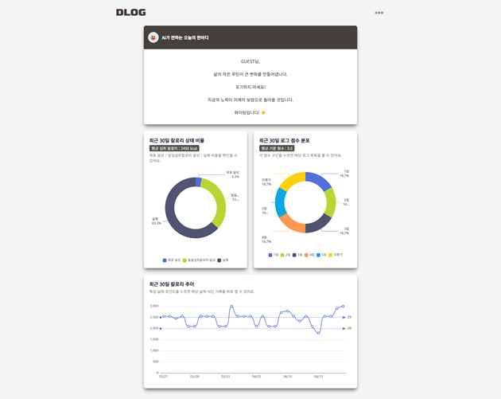
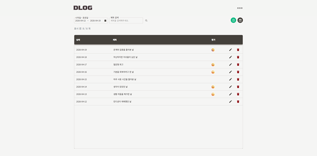
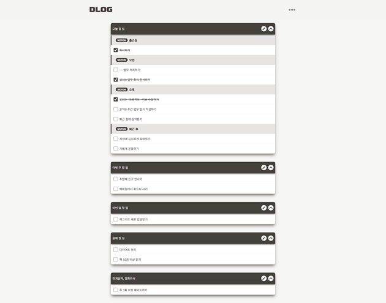
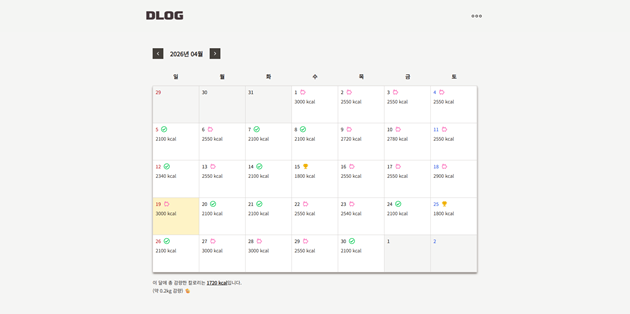
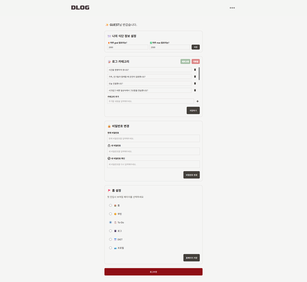

# Daily Log

> 기록, 식단, 루틴, 할 일, 프로필 관리를 한곳에서 다루는 개인 생산성 앱  
> **Next.js (App Router) · NestJS · Prisma · PostgreSQL**

Daily Log는 하루 기록을 남기고, 식단과 칼로리를 관리하고, 루틴과 할 일을 추적할 수 있도록 만든 풀스택 웹 애플리케이션입니다.  
현재 프로젝트는 **모노레포 구조**로 운영되며, 프론트엔드는 Next.js App Router, 백엔드는 NestJS + Prisma 기반으로 구성되어 있습니다.

최근 구조 변경에 맞춰 프론트엔드는 **페이지별 feature 분리**, **Route Handler 기반 API 중계**, **쿠키 기반 인증 흐름** 중심으로 정리되어 있습니다.

---

## 프로젝트 개요

- **프로젝트명**: Daily Log
- **형태**: 개인 사이드 프로젝트
- **구성**: Monorepo (`apps/frontend`, `apps/backend`)
- **목적**: 일상 기록과 생산성 관리를 하나의 앱으로 통합

이 프로젝트는 단순 CRUD보다 아래 항목에 더 초점을 맞췄습니다.

- 인증이 필요한 앱을 안정적으로 운영할 수 있는 **쿠키 기반 인증 구조**
- Next.js 서버 레이어를 활용한 **백엔드 API 중계와 SSR 진입 흐름**
- React Query를 중심으로 한 **서버 상태 관리 표준화**
- **페이지 첫 진입 시 SSR 프리페치 + initialData 적용**으로 초기 로딩 경험 개선
- 로그/기록 화면에서의 **대용량 데이터 탐색 경험 개선**

---

## 주요 기능

### 1. 홈 대시보드

- `/home` 진입 시 주요 기록 데이터를 한눈에 확인
- 차트 카드 기반 요약 UI 제공
- log 데이터 기반 AI 조언 및 위로 제공
- 기본 진입 페이지는 `localStorage`의 `defaultHome` 값으로 제어 (프로필 페이지에서 변경 가능)

### 2. 식단 / 칼로리 관리

- `/diet`에서 식단 및 칼로리 기록 조회/관리
- 월간/일간 단위로 데이터를 확인하는 흐름
- 식단 관련 화면 로직은 `features/diet`로 분리

### 3. 로그 관리

- `/log`에서 기록 목록 조회 및 관리
- 검색, 목록 탐색, 엑셀 다운로드 API 제공
- 많은 로그를 다루는 화면을 고려한 구조

### 4. 루틴 관리

- `/routine`에서 반복 루틴 조회 및 관리
- 루틴 데이터를 별도 feature 레이어에서 관리

### 5. 할 일 관리

- `/todo`에서 할 일 조회 및 관리
- UI와 비즈니스 로직을 feature 단위로 분리

### 6. 인증 / 사용자 관리

- 로그인, 회원가입, 로그아웃, 토큰 재발급
- `/profile`에서 사용자 정보 수정, 비밀번호 변경
- 인증 상태에 따라 public/private 페이지 접근 제어

### 7. AI 연동 확장 포인트

- 사용자 관련 AI 대화 API 라우트가 포함되어 있음
- 프론트/백엔드 모두 OpenAI SDK 의존성이 연결되어 있어 확장 가능

---

## 기술 스택

### Frontend

- **Next.js 15** (App Router)
- **React 19**
- **TypeScript**
- **Tailwind CSS 4**
- **@tanstack/react-query**
- **Jotai**
- **ECharts**
- **notistack**
- **Framer Motion**
- **react-window / react-virtualized-auto-sizer**
- **@dnd-kit**
- **Capacitor**

### Backend

- **NestJS 11**
- **Prisma**
- **PostgreSQL**
- **JWT / Passport**
- **class-validator / class-transformer**
- **Swagger**

### Workspace / Tooling

- **pnpm workspace**
- **ESLint**
- **Jest**

---

## 현재 디렉터리 구조

```text
Daily-Log/
├── apps/
│   ├── backend/
│   │   ├── prisma/
│   │   └── src/
│   │       ├── auth/
│   │       ├── calories/
│   │       ├── log/
│   │       ├── routine/
│   │       ├── todos/
│   │       └── users/
│   └── frontend/
│       ├── app/
│       │   ├── api/
│       │   ├── diet/
│       │   ├── home/
│       │   ├── log/
│       │   ├── login/
│       │   ├── profile/
│       │   ├── routine/
│       │   ├── signup/
│       │   └── todo/
│       ├── components/
│       ├── features/
│       ├── lib/
│       ├── constants/
│       └── types/
├── docs/
├── package.json
├── pnpm-workspace.yaml
└── README.md
```

---

## 프론트엔드 구조

현재 프론트엔드는 **App Router + feature 기반 구조**를 중심으로 구성되어 있습니다.

### app/

라우팅과 페이지 엔트리 역할을 담당합니다.

예시:

- `app/home/page.tsx`
- `app/diet/page.tsx`
- `app/log/page.tsx`
- `app/routine/page.tsx`
- `app/todo/page.tsx`
- `app/profile/page.tsx`
- `app/login/page.tsx`
- `app/signup/page.tsx`

또한 `app/api/*` 아래에서 Next.js Route Handler가 백엔드 API와 통신하는 **중계 레이어** 역할을 합니다.

### features/

화면별 UI와 비즈니스 로직을 기능 단위로 나눠 관리합니다.

예시:

- `features/home`
- `features/diet`
- `features/log`
- `features/routine`
- `features/todo`
- `features/profile`
- `features/auth`

일반적으로 feature 내부는 다음과 같이 구성됩니다.

- `components/`: 화면 UI
- `hooks/`: 페이지 전용 상태/요청 로직
- `types.ts`: feature 전용 타입
- `constants.ts`, `utils.ts`: 필요 시 분리

### components/

여러 feature에서 재사용되는 공통 UI를 관리합니다.

- `atoms`
- `molecules`
- `organisms`
- `providers`
- `template`

### lib/

공통 유틸리티와 API 클라이언트 레이어를 둡니다.

- `lib/api/server.ts`: Route Handler에서 백엔드와 통신하는 공통 fetch 래퍼
- `lib/hooks`: 공용 훅
- `lib/utils`: 범용 유틸리티

---

## 인증 구조

현재 인증은 **쿠키 기반 JWT 인증** 흐름으로 동작합니다.

### 흐름 요약

1. 사용자가 `/login`에서 로그인
2. 프론트의 Route Handler가 백엔드 `/auth/login` 호출
3. 백엔드가 `accessToken`, `refreshToken` 쿠키를 내려줌
4. 이후 프론트는 `/api/*`를 통해 요청하고, 서버 레이어가 쿠키를 포함해 백엔드에 재전달
5. 보호 페이지 접근은 `middleware.ts`에서 `refreshToken` 존재 여부 기준으로 제어
6. 백엔드 요청이 401이면 `refresh` 요청 후 원 요청을 재시도

### 왜 이렇게 구성했는가

- 브라우저에서 토큰을 직접 다루는 책임을 줄이기 위해
- Next.js 서버 레이어에서 인증 처리 경계를 더 명확히 하기 위해
- 클라이언트는 화면과 상호작용에 집중하고, 인증/쿠키 처리는 서버 계층에 위임하기 위해

---

## 데이터 요청 구조

프론트엔드의 기본 요청 흐름은 아래와 같습니다.

```text
Client Component
  → Feature Hook
    → /app/api/* Route Handler
      → backendFetch
        → NestJS API
```

이 구조의 장점:

- 쿠키 전달과 인증 재시도 로직을 한 곳에 모을 수 있음
- 화면 코드에서 백엔드 URL과 인증 세부사항을 직접 다루지 않아도 됨
- React Query와 결합해 캐싱/무효화 흐름을 일관되게 관리할 수 있음

---

## 상태 관리 방식

### 서버 상태

**React Query**를 사용합니다.

- 조회 캐싱
- refetch 정책 관리
- mutation 이후 무효화
- 전역 fetch/mutation 상태 추적

`QueryProvider`에서는 다음 역할을 담당합니다.

- 전역 QueryClient 설정
- fetch/mutation 진행 중 상태를 전역 로딩 상태와 동기화
- 401 에러 발생 시 로그인 페이지 리다이렉트 처리
- React Query Devtools 연결

### UI 상태

**Jotai**를 사용합니다.

- 전역 로딩 상태
- 에러 메시지
- alert / confirm UI 상태

즉, **서버 상태와 UI 상태를 구분**해서 관리하고 있습니다.

---

## 백엔드 구조

NestJS 모듈 기반으로 기능을 나누고 있습니다.

- `auth`: 로그인, 회원가입, 토큰 재발급
- `users`: 사용자 정보 조회/수정, 비밀번호 변경, AI 관련 기능
- `calories`: 식단/칼로리 관리
- `log`: 로그 관리 및 엑셀 관련 기능
- `routine`: 루틴 관리
- `todos`: 할 일 관리

공통 레이어 예시:

- `guards/jwt.guard.ts`
- `filters/global-exception.filter.ts`
- `interceptors/response.interceptor.ts`
- `prisma.service.ts`

---

## 실행 방법

## 1. 패키지 설치

```bash
pnpm install
```

## 2. 환경변수 설정

### backend

```bash
cp apps/backend/.env.example apps/backend/.env
```

예시 항목:

- `DATABASE_URL`
- `JWT_ACCESS_SECRET`
- `JWT_REFRESH_SECRET`
- `SIGN_UP_SECRET_KEY`
- `GUEST_EMAIL`
- `GUEST_PASSWORD`
- `OPENAI_API_KEY`
- `ALLOWED_ORIGINS`

### frontend

프론트엔드는 다음 환경변수를 사용합니다.

```env
NEXT_PUBLIC_API_URL=http://localhost:3000/api
API_URL=http://localhost:4000
```

- `NEXT_PUBLIC_API_URL`: 클라이언트에서 접근할 프론트 API 경로
- `API_URL`: Route Handler가 실제로 호출할 백엔드 서버 주소

## 3. 데이터베이스 준비

```bash
pnpm --filter backend prisma generate
pnpm --filter backend prisma migrate dev
```

## 4. 개발 서버 실행

백엔드:

```bash
pnpm dev:backend
```

프론트엔드:

```bash
pnpm dev:frontend
```

기본적으로 다음 포트를 사용하게 됩니다.

- frontend: `http://localhost:3000`
- backend: `http://localhost:4000`

---

## 스크립트

```bash
pnpm dev:frontend
pnpm dev:backend
pnpm build:frontend
pnpm build:backend
```

## 라우트 요약

### 페이지 라우트

- `/home`
- `/diet`
- `/log`
- `/routine`
- `/todo`
- `/profile`
- `/login`
- `/signup`

루트(`/`)는 사용자의 기본 홈 설정값(`defaultHome`)에 따라 이동합니다.

### 프론트 API 라우트 예시

- `/api/auth/login`
- `/api/auth/signup`
- `/api/auth/logout`
- `/api/auth/refresh`
- `/api/users/me`
- `/api/users/ai-conversation`
- `/api/log`
- `/api/log/all`
- `/api/log/excel`
- `/api/todos`
- `/api/routines`
- `/api/calories`

---

## 이 프로젝트에서 중요하게 보는 포인트

### 1. 구조화된 프론트엔드

페이지가 늘어나더라도 `app`과 `features`의 책임을 분리해 유지보수하기 쉽게 구성했습니다.

### 2. 인증 안정성

클라이언트 메모리나 localStorage 중심 인증보다, 서버 중계 + 쿠키 인증 흐름을 사용해 보안과 책임 분리를 강화했습니다.

### 3. 서버 상태 관리 일관성

조회/수정/무효화 패턴을 React Query 중심으로 통일해 데이터 흐름을 예측 가능하게 만들었습니다.

### 4. 확장 가능한 모노레포

프론트엔드와 백엔드를 분리하면서도 하나의 저장소에서 관리해 기능 확장과 배포 준비에 유리한 구조를 만들었습니다.

---

## 스크린샷

### 홈 / 회고 화면



### 로그 목록 화면



### 할 일 관리 화면



### 칼로리 관리 화면



### 프로필 화면



---

## 배포

- Demo: [서비스 바로가기](https://daily-log-frontend-piof.vercel.app/)

---

## 회고

이 프로젝트를 통해 단순 기능 구현보다  
**사용자의 경험을 어떻게 설계할지**와 **프론트엔드 구조를 어떻게 만들지**를 많이 고민했습니다.

특히 아래 경험이 의미 있었습니다.

- 대량 목록 렌더링 최적화
- 쿠키 기반 인증 구조 설계
- Route Handler를 포함한 프론트 API 계층 정리
- React Query 기반 서버 상태 관리 패턴 구축
- SSR 초기 데이터 연결과 클라이언트 동기화 흐름 정리

실무에서도 자주 마주치는 문제인 **렌더링 비용**, **상태 분리**, **인증 처리**, **데이터 패칭 구조 설계**, **사용자 경험 개선**을 개인 프로젝트에서 직접 다뤄볼 수 있었던 점이 가장 큰 수확이었습니다.
